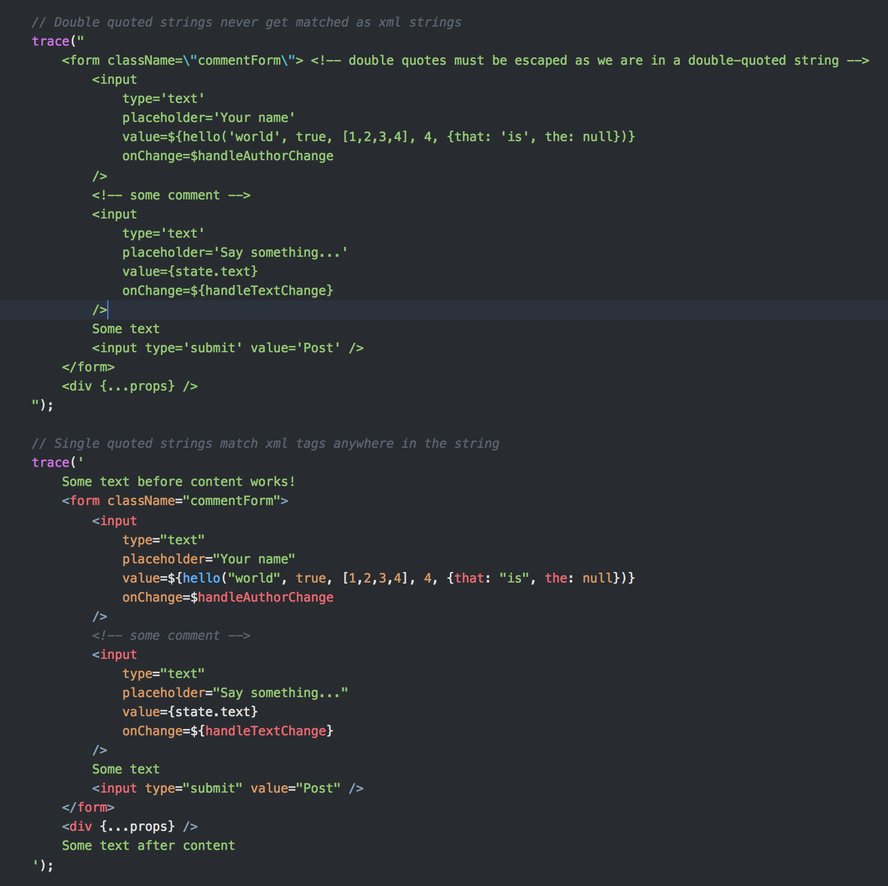

# xmlgrammar

Patch main haxe grammar to get xml syntax highlighting in strings.

This utility fetched main haxe grammar file and patches it to provide syntax coloring of xml tags in single-quoted strings (see preview below).



## How to use

First of all, install the utility with ``haxelib install xmlgrammar``.

### Output patched grammar in YAML format

```
haxelib run xmlgrammar --yaml
```

### Output patched grammar in PLIST format

```
haxelib run xmlgrammar --plist
```

### Patch Visual Studio Code extension (vshaxe)

This command will detect your installed version of `vshaxe` and patch its haxe grammar file. Simply restarting Visual Studio Code after the patch should make xml syntax highlighting work.

```
haxelib run xmlgrammar --vscode
```

On windows, detection of your Visual Studio Code extensions directory is not supported yet, but you can provide your extension directory with ``--vscode-ext-path``. This option can also be used if you want to patch a non-standard vscode extension path.

```
haxelib run xmlgrammar --vscode --vscode-ext-path 'path/to/your/.vscode/extensions'
```
